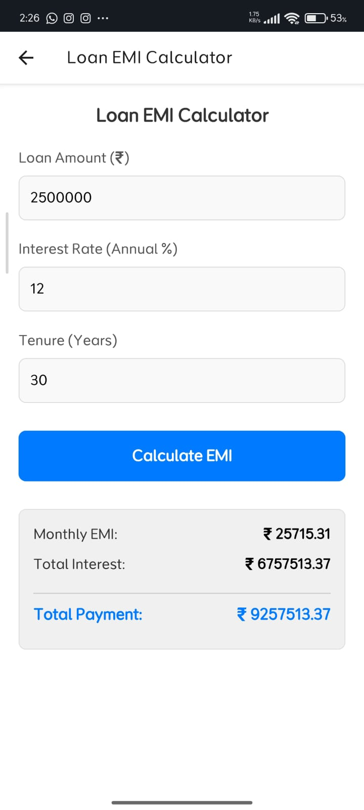
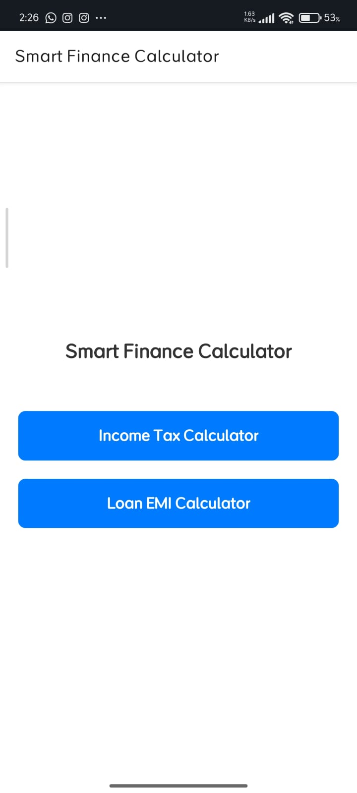

# Experiment 1: EMI Calculator

## Description
A comprehensive Mobile Application to calculate Equated Monthly Installments (EMI) for various loans. This application allows users to input loan amounts, interest rates, and loan durations to get accurate monthly payment calculations.

## Features
- Loan amount input
- Interest rate slider/input
- Tenure selection (Years/Months)
- Instant EMI calculation display
- Responsive UI for Mobile

## Screenshots

## How to Run
1. Install dependencies: `npm install`
2. Start the project: `npm start`
3. Run on Android/iOS via Expo Go.
