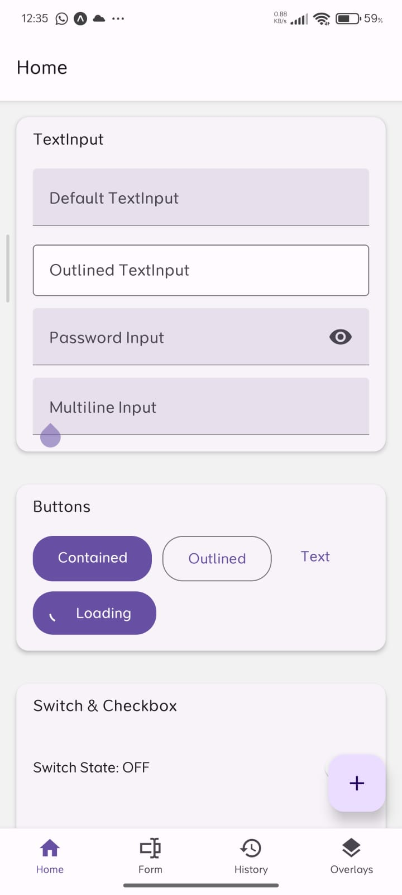

# Experiment 10: Advanced Mobile GUI Components (ComponentKit)

## Description
A comprehensive GUI dashboard built using `react-native-paper` and `react-hook-form`. It showcases sophisticated UI elements like Sliders, Bottom Tabs, Stack Navigation, and Multi-step forms in a high-fidelity mobile interface.

## Features
- Dynamic form validation
- Premium UI elements (Card, Dialog, FAB)
- Image picking and Slider control
- Multi-navigator architecture (Stack + Tabs)

## Screenshots

## How to Run
1. Install dependencies: `npm install`
2. Run: `npx expo start`
