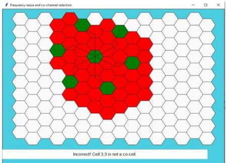

# Experiment 2: Frequency Reuse Simulation

## Description
A Python simulation to demonstrate the concept of frequency reuse in cellular networks. The simulation calculates the cluster size (N), reuse distance (D), and signal-to-interference ratio (SIR) based on user-defined parameters.

## Parameters
- Hexagonal cell layout simulation
- Path loss exponent adjustment
- Co-channel interference visualization
- Cluster size calculation ($N = i^2 + ij + j^2$)

## Screenshots

## How to Run
1. Ensure Python 3.x is installed.
2. Run the script: `python code.py`
