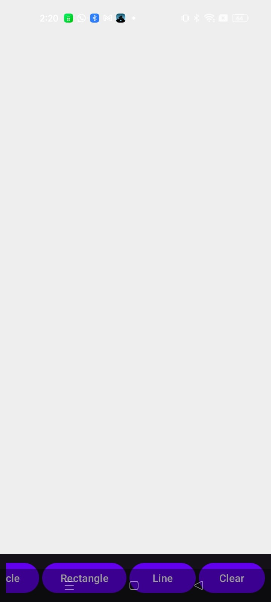

# Experiment 3: Canvas Drawing App (SmartCanvas)

## Description
A React Native application demonstrating the use of the HTML5 Canvas API (via `react-native-canvas` or similar) to provide a drawing interface for users to sketch, paint, and save their ideas.

## Features
- Multi-color brush support
- Drawing pressure and stroke width adjustment
- Erase and Undo/Redo functionality
- Clear Canvas and Export options

## Screenshots

## How to Run
1. Install dependencies: `npm install`
2. Start the project: `npm start`
