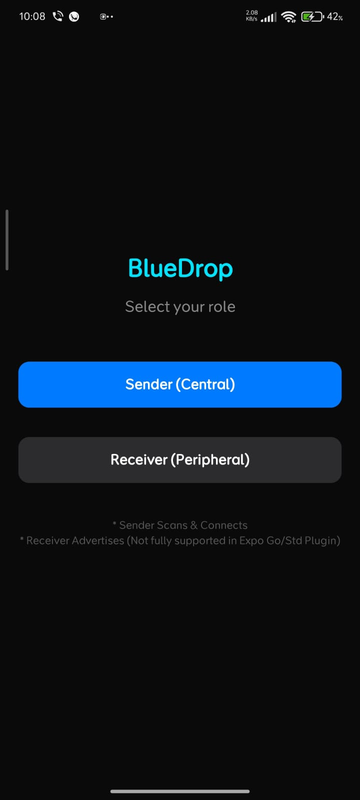
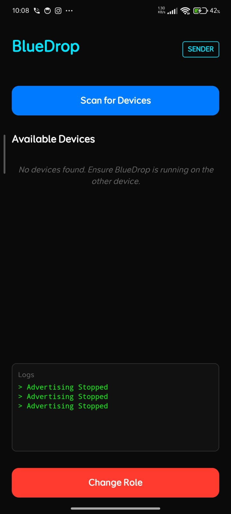

# Experiment 4: Bluetooth Connectivity (BlueDrop)

## Description
A React Native application demonstrating the usage of `react-native-ble-plx` or standard Bluetooth APIs to scan for nearby devices, connect, and exchange data (BLE or RFCOMM).

## Features
- Scan for nearby Bluetooth devices
- Pair and connect functionality
- Data transfer indicators
- Bluetooth state management (ON/OFF detection)

## Screenshots

## How to Run
1. Install dependencies: `npm install`
2. Start the project: `npx expo start`
