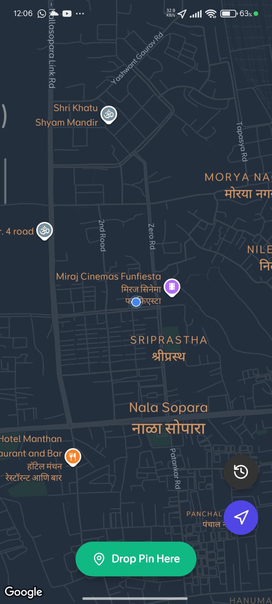
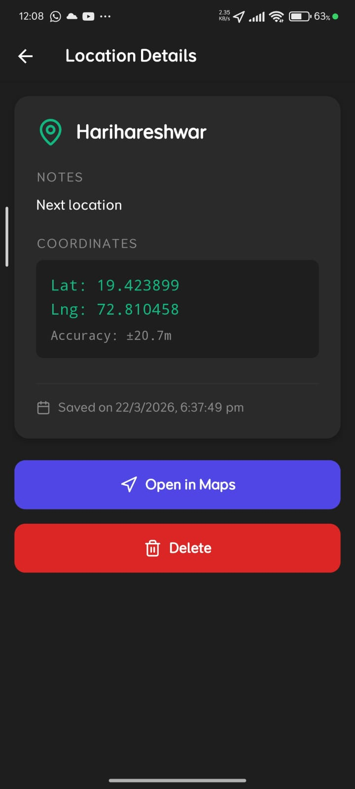

# Experiment 6: GPS and Location Tracking (TrailMark)

## Description
A Real-time location tracking application using `expo-location` and `react-native-maps`. Users can mark their current location, track trails on a map, and view their history of saved coordinates.

## Features
- Real-time GPS coordinate acquisition
- Google Maps/Apple Maps integration
- Mark and Label specific locations
- Distance and Speed calculations

## Screenshots

## How to Run
1. Go to directory: `cd TrailMark`
2. Install dependencies: `npm install`
3. Run: `npx expo start`
