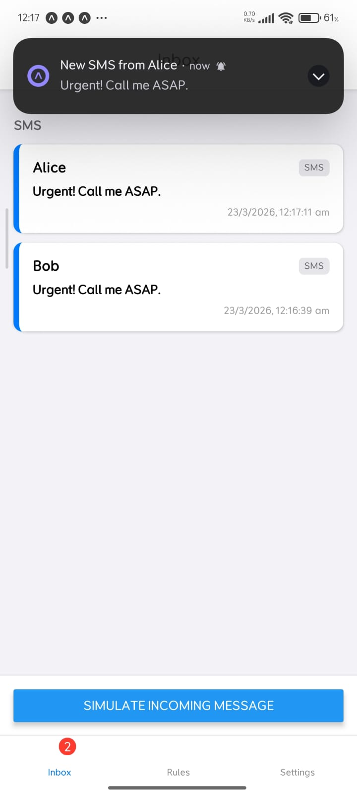
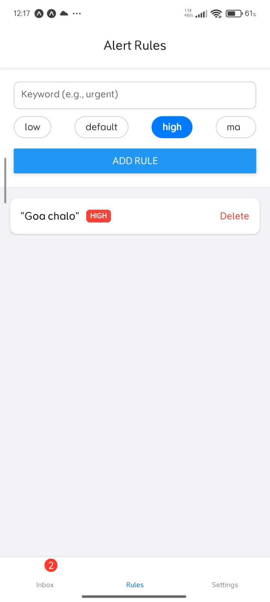

# Experiment 7: Background Services and Notifications (PingBox)

## Description
A background monitoring and alert system implemented using `expo-notifications`, `expo-background-fetch`, and `expo-task-manager`. The app can run tasks in the background and provide push notifications to the user based on specific events.

## Features
- Push and Local Notification scheduling
- Background fetch for periodic data updates
- Persistent alert logs
- Low-latency response to system events

## Screenshots

## How to Run
1. Install dependencies: `npm install`
2. Run: `npx expo start`
