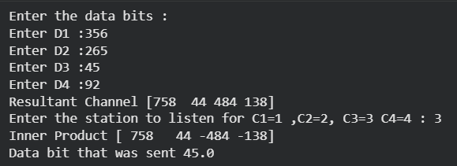

# Experiment 8: CDMA Encoding and Decoding Simulation

## Description
A Python script to demonstrate the Code Division Multiple Access (CDMA) technique used in cellular communication. It performs orthogonal spreading code multiplication and decoding for multiple data bits on a single channel.

## Simulation Steps
- Spreading codes for 4 stations
- Composite signal calculation (Resultant Channel)
- Decoding at the listener station via inner product
- Restoration of original data bit

## Screenshot

## How to Run
1. Ensure Python 3.x and `numpy` are installed.
2. Run: `python cdma.py`
