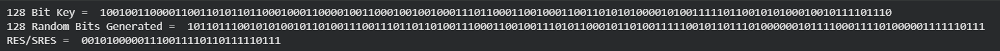

# Experiment 9: GSM Security Mechanisms (SRES)

## Description
A Python implementation to demonstrate the authentication and key generation process in GSM networks. It simulates the generation of Signed Response (SRES) from a 128-bit key (Ki) and a 128-bit Random Number (RAND) using a simplified A3 architecture.

## Algorithm
- Random bit generation (128-bit Ki/RAND)
- XOR operations on bit segments
- Bit-wise segment manipulation
- 32-bit/64-bit SRES/Kc derivation

## Screenshot

## How to Run
1. Run: `python code.py`
